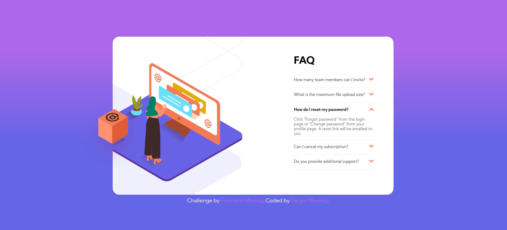

# Frontend Mentor - FAQ accordion card solution 

Esta es una solución al [FAQ accordion card challenge on Frontend Mentor](https://www.frontendmentor.io/challenges/faq-accordion-card-XlyjD0Oam). Los desafíos de Frontend Mentor lo ayudan a mejorar sus habilidades de codificación mediante la construcción de proyectos realistas. 

## Table of contents

- [Descripción general ](#descripción-general)
  - [El reto](#el-reto)
  - [Captura de pantalla ](#captura)
  - [Enlaces](#enlaces)
- [Mi proceso](#my-process)
  - [Construido con](#built-with)
  - [Que aprendí](#que-aprendí)
  - [Desarrollo continuo](#desarrollo-continuo)
  - [Recursos útiles](#recursos-útiles)
- [Autor](#autor)

## Descripción general 

### El reto

Los usuarios deben poder: 

- Ver el diseño óptimo para el componente según el tamaño de pantalla de su dispositivo
- Ver estados de desplazamiento para todos los elementos interactivos en la página
- Ocultar / mostrar la respuesta a una pregunta cuando se hace clic en la pregunta


### Captura



### enlaces

- Solution URL: [Add solution URL here](https://your-solution-url.com)
- Live Site URL: [Add live site URL here](https://your-live-site-url.com)

## My process

### Built with

- HTML
- CSS
- Flexbox
- CSS Grid

### Que aprendí

El como solucionar el tema del acordeon solo usando CSS, se que no es la solucion que plantea el reto, pero cambie las reglas de juego para ver si yo podia solamente hacer lo mismo sin usar js

```css
.acordeon input:checked ~ .acordeon__contenido{ /*Para mostrar el texto*/
    height: auto;
    padding-bottom: 10px;
    border-bottom: 1px solid hsla(240, 6%, 50%, 0.153);
}
.acordeon input:checked ~ .acordeon__titulo{
    border: none;
    color: hsl(238, 29%, 16%);
    font-weight: 700;
}
```
Lo otro que he aprendido en este desafio, es el "esconder" parte de una imagen ya sea una parte, la mitad o lo que se necesite, con el juego de div's y ordenar bien el codigo desde HTML

### Desarrollo continuo

Seguir mejorando en cuanto al tiempo que me lleva hacer este tipo de proyectos, el mejorar la semantica HTML y CSS para serlo mas legible y poder dar mejores respuestas con un codigo mas legible y ordenado

### Recursos útiles

- [w3schools](https://www.w3schools.com/) - La vieja y confiable, ya que no recordaba algunas cosas en espeficico
- [StackOverflow](https://stackoverflow.com/) - este es un recurso asombroso. Pude hacer algunas preguntas y obtener comentarios positivos.
- [CSSGradient](https://cssgradient.io/) - Me sirvio para ver el degradado de colores que me ofrecian para poder adaptarlo a mi gusto y a lo requerido.


## Autor

- Website - [Add your name here](https://www.your-site.com) (próximamente)
- Frontend Mentor - [@Sergio Moreno](https://www.frontendmentor.io/profile/SergioMMoreno)
- Twitter - [@SoySergio](https://twitter.com/SoyNeroo)
